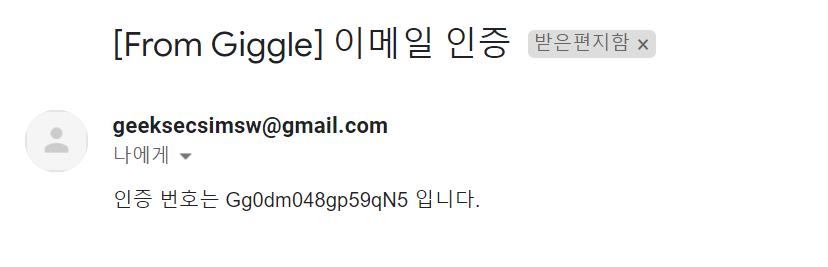
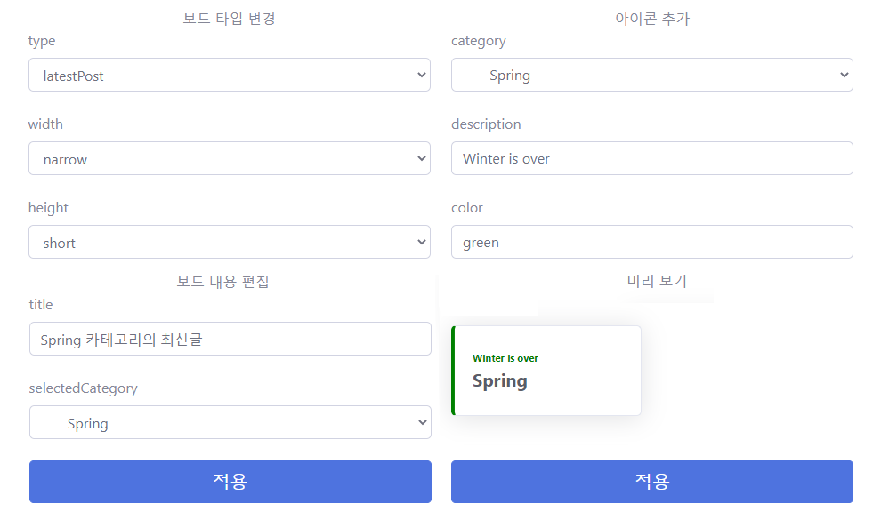
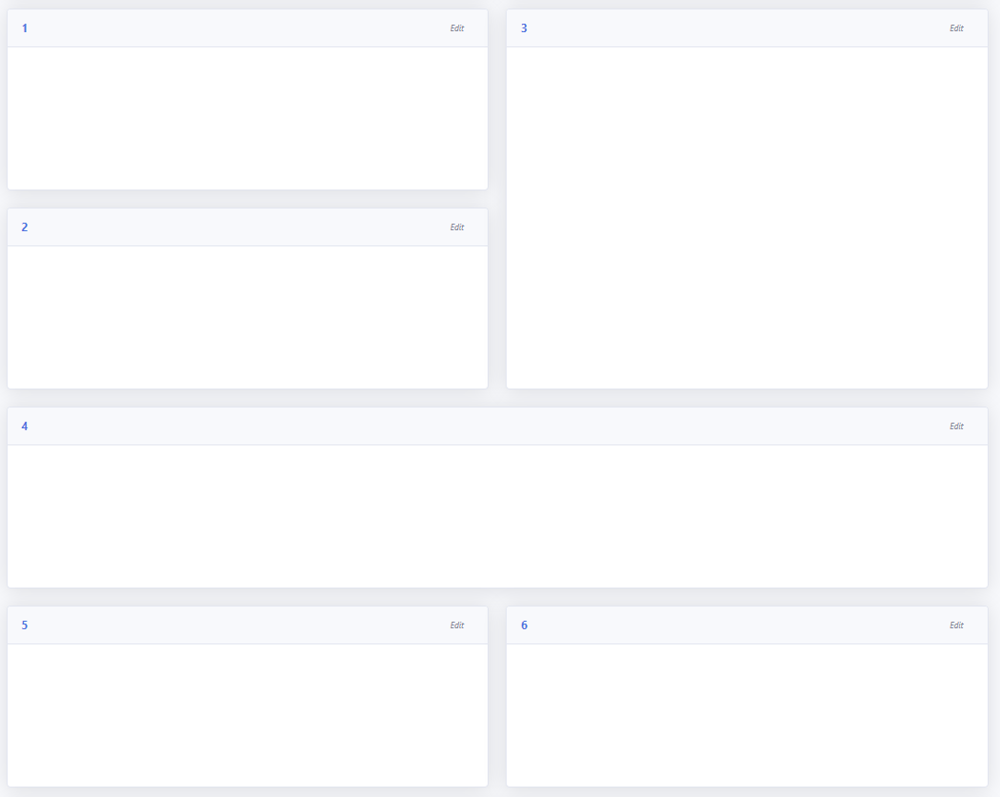
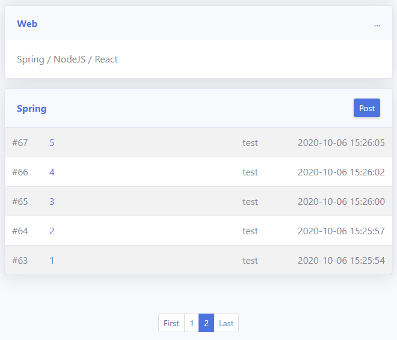
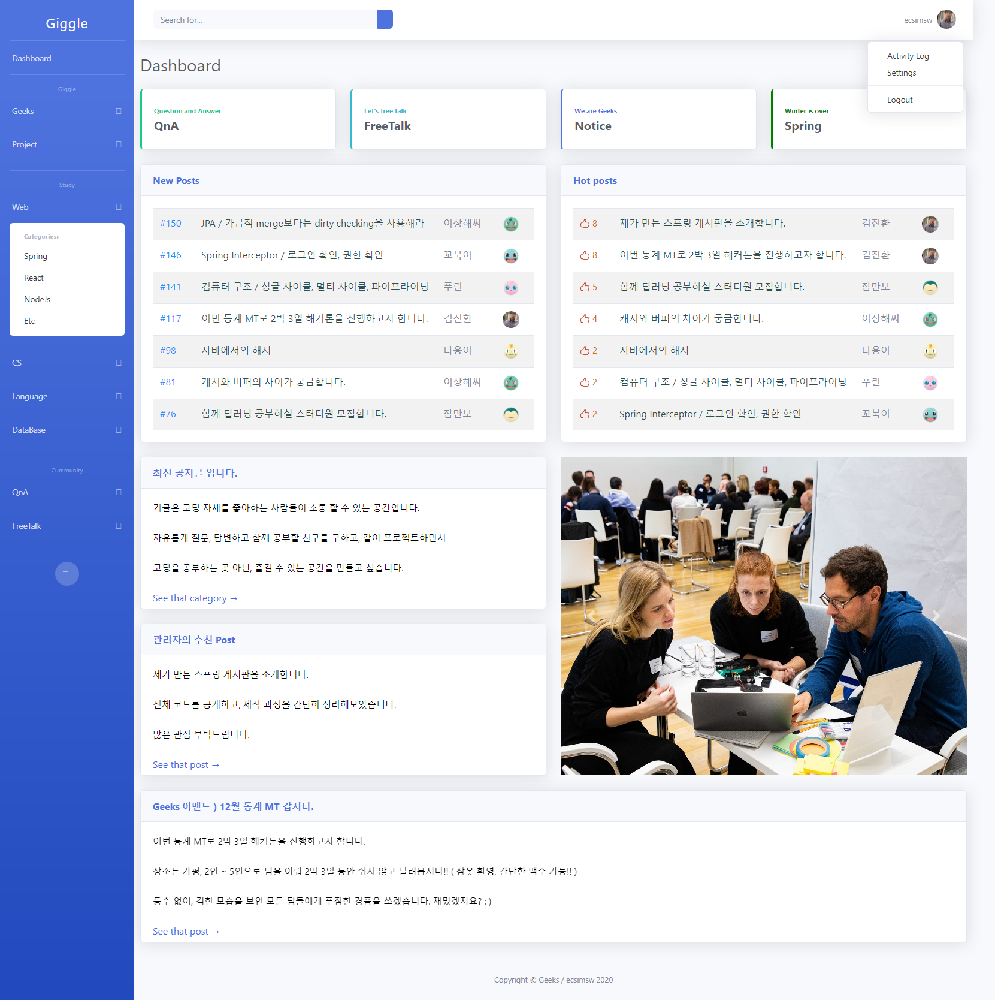
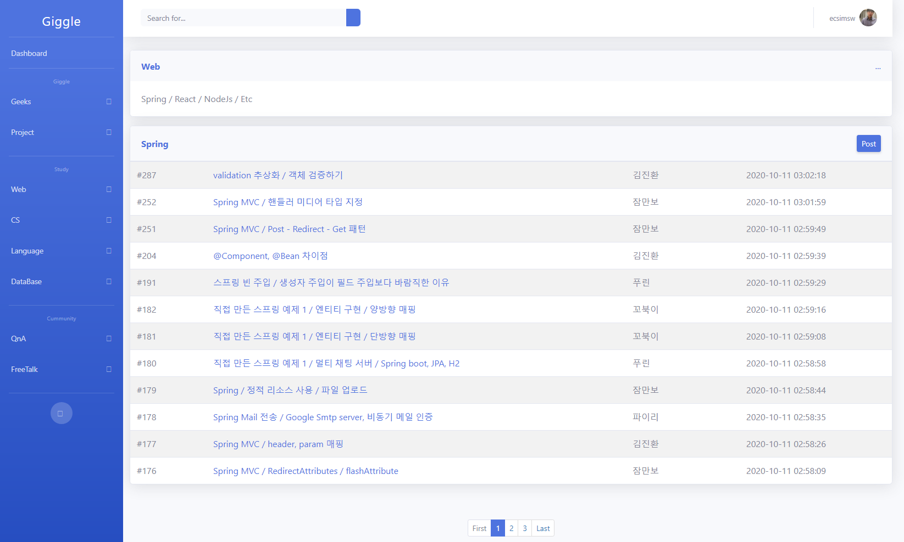
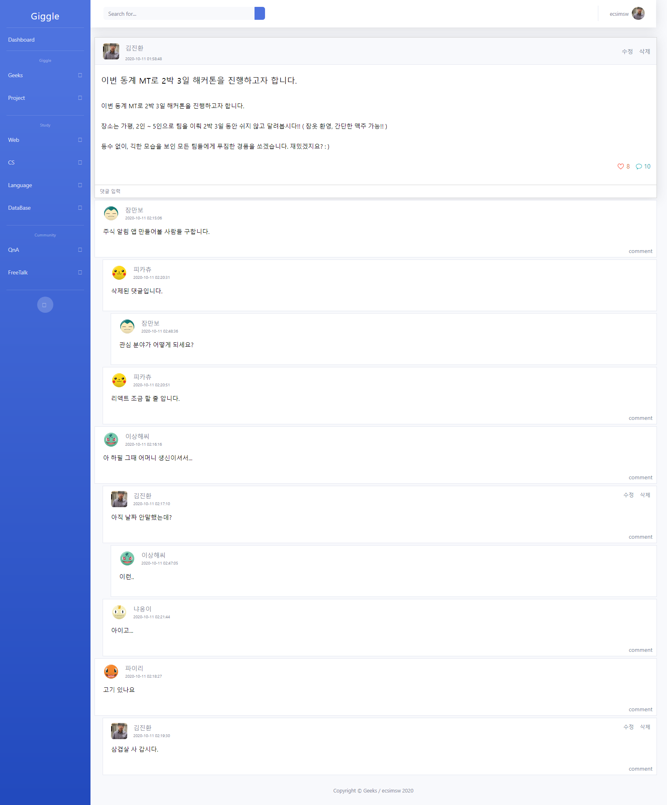
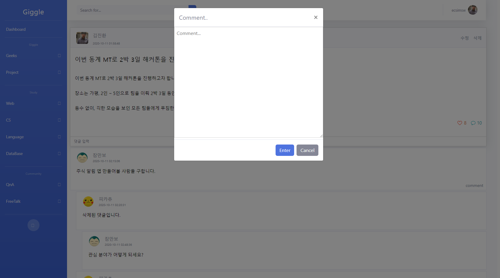
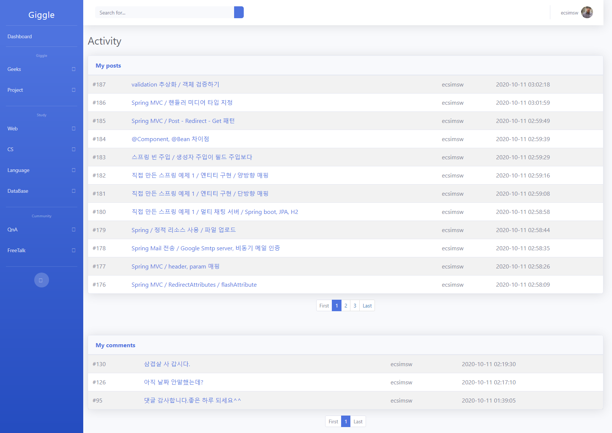
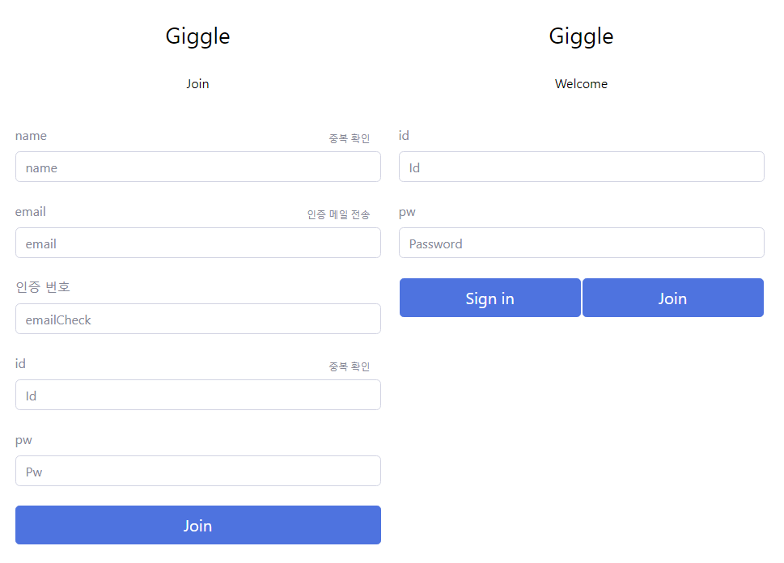

# Giggle : Community for geeks

  1. Spring mvc, JPA를 공부 후 실제로 사용해보고 싶었습니다.

  2. 컴퓨터 자체를 즐기는 사람들과 소통 할 수 있는 커뮤니티를 만들고 싶었습니다.

&nbsp;&nbsp;&nbsp;&nbsp;   회원들이 자유롭게 글을 작성하거나 댓글을 남기고, 관리자는 커뮤니티의 필요에 따라 자유롭게 게시판 카테고리를 생성하고, 홈페이지를 꾸미며, 회원을 관리할 수 있는 커뮤니티를 만들고자 하였습니다. 
  
&nbsp;&nbsp;&nbsp;&nbsp;   Geeks는 제가 학교에서 개발 자체를 좋아하는 친구들과 소통하고 싶어 만든 모임입니다. 친구들이 공부한 걸 정리하고, 자유롭게 소통하고, 프로젝트 결과물을 자랑할 수 있는 공간을 만들고 싶었습니다.

  3. 프로젝트에서 가장 집중한 부분은 다음과 같습니다.

 &nbsp;&nbsp;&nbsp;&nbsp;  Spring IoC / Spring MVC 의 동작 원리와 구조를 이해하고 프레임워크의 기능을 사용하고 싶었습니다. 

&nbsp;&nbsp;&nbsp;&nbsp;  엔티티 간의 연관 관계가 DB 설계 측면에서 적절한지, 객체지향 관점에서 합리적인지 생각하려고 노력했습니다.

&nbsp;&nbsp;&nbsp;&nbsp;  트래픽, 데이터가 많은 경우를 가정하며 간단한 처리에도 보다 효율적인 로직을 찾고자 고민하였습니다.

  4. Giggle은 아이들이 깔깔 웃는다는 의미로, 'Geek을 위한 Giggle' 이라는 말 장난에서 지어진 커뮤니티 이름입니다. 

  
<br/>
    
# 개발환경 

  Spring boot 2.1.7

  Gradle 6.1.1

  Hibernate1.4.199 / JPA 

  Java 11

  Thymeleaf / Javascript (Jquery, ajax)

<br/>


# 상세 내용 / 코드 설명

### 포스트와 댓글 / 일대다 양방향 매핑
<br/>
포스트와 댓글은 1:N 양방향 매핑으로, 댓글, N차 대댓글은 자기 참조로 상위 댓글와, 하위 댓글 리스트를 갖도록 하여 계층을 만들어 구현했습니다.

```java
@Entity
public class Comment {

   ...

    @ManyToOne(fetch=FetchType.LAZY)
    @JoinColumn(name="post_id")
    private Post post;
    
    @ManyToOne(fetch=FetchType.LAZY)
    @JoinColumn(name = "super_comment_id")
    private Comment superComment;

    @OneToMany(mappedBy = "superComment", cascade = CascadeType.ALL)
    private List<Comment> subComment = new ArrayList<>();

    private int level;

    private boolean isLive;
}
```

코드 내에서 댓글을 삭제할 때는 하위 댓글까지 한번에 삭제되는 것을 막기 위해 하위 댓글이 남아있다면 댓글의 내용을 변경하여 삭제 예정만을 표시되고,

하위 댓글이 남아 있지 않은 경우, 상위 댓글이 같이 삭제되어야 하는지 확인하는 방식으로 삭제 처리를 구현하였습니다.

```java
@Service
@RequiredArgsConstructor
@Transactional(readOnly = true)
public class CommentService {
  
  private final CommentRepository commentRepository;
  
  @Transactional
  public void deleteComment(long commentId){
      Comment commentToDelete = commentRepository.findById(commentId);
      if(commentToDelete.getSubComment().size()==0){
          // 하위 댓글이 없다면 해당 댓글은 삭제하되, 상위 댓글의 삭제가 필요한지 확인해야한다.
          while(commentToDelete!=null){
              Comment superComment = commentToDelete.getSuperComment();
              if(superComment ==null){
                  // 상위 댓글이 없다면, 해당 댓글만 지우고 탐색을 종료한다.
                  commentRepository.deleteById(commentToDelete.getId());
                  break;
              }
              superComment.getSubComment().remove(commentToDelete);
              commentRepository.deleteById(commentToDelete.getId());
              if(superComment.getSubComment().size()==0 && !superComment.isLive()){
                  // 상위 댓글이 삭제처리되어야 하는지 확인하고 
                  commentToDelete = superComment;
                  // 삭제 되어야한다면 다시 상위 댓글의 상위 댓글의 하위 댓글을,
                  // 그렇지 않다면 해당 댓글만을 삭제한다.
              }
              else{ break; }
          }
      }
      else if(commentToDelete!=null){
          // 하위 댓글이 존재한다면, isLive 변수를 false로 표시하고, 댓글 내용만 변경한다.
          commentToDelete.setContent("삭제된 댓글입니다.");
          commentToDelete.setLive(false);
      }
  }
  
  ...
  
}
```

<br/>

### 좋아요 구현 / 다대다 양방향 매핑 처리
<br/>
좋아요는 버튼 클릭 시, 이전에 좋아요를 클릭한 이력이 있다면 좋아요 취소를, 이력이 없다면 좋아요를 처리하도록 만들었습니다.

서버와 통신해서 db에 접근하되, 페이지 이동이나 새로고침을 필요로 하지 않는 것이 중요한 포인트였기 때문에 Ajax를 이용해서 해당 페이지 안에서 서버와 JSON 데이터를 주고 받았습니다.

ORM 측면에서 한 사용자가 여러 Post에 좋아요를 누를 수도, 한 Post가 여러 사용자에게 좋아요를 받을 수 있는 다대다 양방향 매핑이 필요한 상황이었습니다.

이런 N:N 매핑을 Like 엔티티를 추가하여 N:1 + 1:N 의 매핑으로 풀어 참조하도록 구현했습니다.

```java
@Entity
@Table(name = "POST_LIKE")
public class Like {

    @Id
    @GeneratedValue
    @Column(name="like_id")
    private Long id;

    @ManyToOne(fetch = FetchType.LAZY)
    @JoinColumn(name="member_id")
    private Member member;

    @ManyToOne(fetch = FetchType.LAZY)
    @JoinColumn(name="post_id")
    private Post post;
    
    // equals(), hashCode()
}
```

Post의 like는 1:N 매핑의 N+1 문제를 피하기 위해 Set을 사용하였습니다.

```java
@Entity
public class Post { // Member 동일
   
    ...
   
    @OneToMany(mappedBy = "post", cascade = CascadeType.ALL)
    private Set<Like> like = new HashSet<>();
}
```

<br/>

### 로그인, 권한 확인 / Interceptor
<br/>
어노테이션으로 핸들러 당 필요한 권한을 표시하고, 인터셉터를 사용해서 로그인 여부, 유저의 타입을 확인하였습니다.

사실 프로젝트 이전, 인터셉터에 대한 개념이 없어, 컨트롤러에서 일일이 세션의 값을 찾아 로그인을 확인하고, 권한을 확인하는 방식으로 코딩했었다가, 가독성 부분이나 유지 보수에 좋지 못하다는 생각이 들었고

요청을 처리할 핸들러에 어노테이션으로 필요한 권한을 간단히 표시할 수 있는 방법이 없을까를 고민하게 되었습니다. 그렇게 인터셉터라는 개념을 공부하여 인터셉터를 이용해 지정한 요청의 로그인 여부를 미리 확인하여 로그인 페이지로 리다이렉트 시키거나, 어노테이션으로 필요한 멤버 타입을 설정하고, 조건에 부합하지 않으면 처리를 막는 처리할 수 있었습니다.

아래 LoginInterceptor는 적용할 루트와 배제할 루트를 미리 정하고, 로그인 필요 루트에서 세션에 로그인 정보가 없을 시 로그인 페이지로 이동 후, 로그인을 정상적으로 마치면 다시 요청했던 루트로 리다이렉트 시킬 수 있도록 하였습니다. 

```java
public class LoginIntercepter implements HandlerInterceptor {
    public List loginEssential
            = Arrays.asList("/post/**", "/comment/**", ... );
    public List loginInessential
            = Arrays.asList("/post/board/**", "/post/read/**", ...);

    @Override
    public boolean preHandle(HttpServletRequest request, HttpServletResponse response, Object handler) {
        String loginId = (String)request.getSession().getAttribute("loginId");
        if(loginId != null){return true;}
        else{
            String destUri = request.getRequestURI();
            String destQuery = request.getQueryString();
            String dest = (destQuery == null) ? destUri : destUri+"?"+destQuery;
            request.getSession().setAttribute("dest", dest);
            response.sendRedirect("/member/login");
            return false;
        }
    }
}
```

해당 요청의 멤버 권한 확인은 어노테이션으로 핸들러에 필요한 권한을 명시하여, 그 조건에 부합하는지 확인하는 식으로 처리하였습니다.

```java
@Retention(RetentionPolicy.RUNTIME)
@Target(ElementType.METHOD)
public @interface Permission {
    MemberType authority() default MemberType.member;
}
```

커스텀 어노테이션, Permission을 정의하고 authority로 미리 정의해둔 MemberType을 받아 필요한 멤버 타입을 표시할 수 있습니다.  

```java
public class PermissionInterceptor implements HandlerInterceptor {

    @Override
    public boolean preHandle(HttpServletRequest request, HttpServletResponse response, Object handler) {

        if(handler instanceof HandlerMethod == false){
            return false;
        }

        HandlerMethod method = (HandlerMethod)handler;
        Permission permission = method.getMethodAnnotation(Permission.class);

        if(permission == null) { return true;}

        String authority = (String)request.getSession().getAttribute("authority");

        ... // permission과 세션의 authority 값이 일치하는지 비교.
    }
}
```

PermissionInterceptor를 정의하여, 요청을 처리할 handler에 붙은 Permission 어노테이션의 값을 얻고, 세션의 유저 정보와 일치하는지 확인하였습니다.

```java
@Permission(authority = MemberType.admin)
@GetMapping("/edit/dashBoard/delete")
public String editDashBoardDelete(@RequestParam long id) {
    pageService.deleteDashBoard(id);
    return "redirect:/main";
}
```

이렇게 어노테이션으로 필요한 권한을 간단하게 표시하고, 인터셉터로 핸들러가 호출되기 전 접근 가능 여부를 확인할 수 있습니다. 

아래 링크는 인터셉터를 공부하면서 정리한 개인 블로그 포스팅입니다.

인터셉터의 개념과 사용 예시, 구현 중 생긴 문제 고민과 해결 방안을 정리해보았습니다.

_[Tstroy / ecsimsw / Spring Interceptor / 로그인 여부 확인을 위한 interceptor 구현](https://ecsimsw.tistory.com/entry/Spring-Interceptor-Spring-boot?category=879374)_

_[Tstroy / ecsimsw / Spring Interceptor / 어노테이션, interceptor을 이용한 유저 권한 확인](https://ecsimsw.tistory.com/entry/Spring-Interceptor-%EA%B6%8C%ED%95%9C-%ED%99%95%EC%9D%B8-%EC%96%B4%EB%85%B8%ED%85%8C%EC%9D%B4%EC%85%98?category=879374)_

<br/>

###  메일 인증 / Google SMTP, 비동기 처리

<br/>

회원 가입 시 해당 이메일이 유효한지 확인하기 위해 [Google SMTP Server](https://support.google.com/a/answer/176600?hl=en)를 사용하였습니다.



회원 가입 페이지에서, 이메일을 입력하고 메일 인증을 요청하면 페이지 내에서 Ajax로 서버에 메일 정보를 전송하고, 서버는 해당 메일 주소와 새로 생성한 임의의 15자리의 암호키를 DB에 저장합니다.

이후 해당 메일 주소로 DB에 저장된 암호키를 전송하면 유저는 본인 메일에 도착한 암호키를 회원 가입 입력창에 직접 입력하는 형식입니다.

이때 서버에서 암호키를 전송하는 시간이 길어, "메일 확인 안내 알림 메시지"가 지연 출력된다는 문제가 있었습니다. 

사용자가 메일 인증 버튼을 누르고, 바로 받아야하는 결과 안내 메시지가 실제로는 서버에서 메일 보내는 것을 다 처리한 이후에나 출력되어 혼동을 주기 때문에 이 문제를 멀티 스레딩으로 해결하고자 하였고, 스프링의 비동기 처리 방식을 공부하여 해결할 수 있었습니다.

```java
@Transactional
@Async
public void sendAuthMail(String to) {
    Email email = memberRepository.findEmailByAddress(to);
    String key = makeRandomKey();

    if(email != null){
        if(email.isUsed()==true){
            // 이미 사용된 이메일, 이전에 미리 중복 체크
            throw new RuntimeException("Mail already used");
        }
        
        // 인증 요청만 하고, 실제 인증하지 않은 더미 이메일
        // 새로운 키 값 업데이트 -> 병합
        email.setKey(key);
    }
    else{
        // 새로 요청한 이메일 주소
        email = new Email();
        email.setKey(key);
        email.setAddress(to);
        email.setUsed(false);
    }
    memberRepository.saveEmail(email);

    // Google Stmp server로 메일 전송
    SimpleMailMessage message = new SimpleMailMessage();
    message.setFrom("geeksecsimsw@gmail.com");
    message.setTo(to);
    message.setSubject("[From Giggle] 이메일 인증");
    message.setText("인증 번호는 "+key+" 입니다.");

    javaMailSender.send(message);
}
```

이렇게 구현한 사용자 이메일 인증 절차는 다음과 같습니다.

  1. 사용자가 이메일을 입력하고 이메일 인증 메일을 요청하면 Ajax로 서버에 해당 메일이 이미 사용된 메일인지 중복 체크하여 사용 불가능한 메일의 경우 결과를 출력합니다.

  2. 사용된 메일이 아니라면 해당 메일이 db에 존재하는지 확인하여, 새로운 키를 지정하여 병합 또는 생성합니다.

(메일 인증 요청을 이미 했으나 인증을 완료하지 않은 더미 메일 주소가 있어, DB에 남아있으나 미사용된 메일이 있을 수 있습니다.)

  3. 메일 인증을 완료하면 주소에 대한 키 값을 암호키가 아닌, 서버에서 지정한 문자열로 값을 변경합니다. 이를 테면 "ok"로 변경합니다.

  4. 실제 회원 가입이 완료될 때는 입력된 메일 주소의 키가 "ok"인지, 즉 메일 주소가 인증된 메일인지 확인하고, 인증된 정상적인 메일이라면 해당 메일의 사용 여부를 변경 후 회원 가입을 마무리합니다.

  이메일 인증 처리를 구현하면서 생긴 문제 사항과, 고민, 해결 방안을 개인 블로그에 정리해 보았습니다.

  특히 어떤 방식으로 이메일 주소와 키를 매핑하는 것이 효율적인지, 여러 사람이 한 메일 주소로 인증을 요청할 경우, 또는 메일 주소를 인증만 하고 회원 가입을 완료하지 않을 경우의 문제를 어떻게 해결할 지에 대한 고민을 풀어 보았습니다.

_[Tstroy / ecsimsw / Spring Interceptor / Google Smtp Server, @Async 비동기 메일 인증](https://ecsimsw.tistory.com/entry/Spring-Mail-Google-Smtp-server-Async)_

<br/>

### 인기 게시물 관리 / 매핑 관계의 주인

<br/>

인기 게시물 관리에 있어, 좋아요와 싫어요가 업데이트 될 때마다 모든 게시물의 좋아요 수를 확인하여 정렬하는 방법은 많은 부하를 낳을 것이기 때문에 최대한 효율적으로 인기 게시물을 뽑을 방법을 고민했습니다.

가장 먼저 떠올린 방법은 관리하는 인기 게시물 중 가장 적은 좋아요 수를 경계 값으로 하고, 어떤 게시물이 좋아요를 받았을 때 그 경계 값 이상이면 인기 게시물에 변동이 되도록 하는 것이었는데

결국 경계 값 업데이트를 위해 한 게시물이 좋아요를 받으면, 모든 인기 게시물 리스트를 탐색하며 해당 게시물이 현재 인기 게시물인지, 그렇다면 경계 값에 변화가 생기는지를 조사해야 할 것이고

따라서 앞서 말한 방식이 단순히 게시물이 좋아요를 받았을 때 인기 게시물 리스트 안의 게시물과 좋아요 개수를 비교하는 것보다 좋은 성능을 기대할 수 없을 것이라는 결론를 내었습니다.

```java
@Service
@Transactional(readOnly = true)
@RequiredArgsConstructor
public class PostService {
  
  private final LikeRepository likeRepository;

  @Transactional
  public void enrollHotPost(Post post, int hotPostCnt){

      List<HotPost> hotPostList = likeRepository.getAllHotPost();

      if(hotPostList.size() < hotPostCnt){...}
      else{
          // 이미 등록된 경우, 다른 처리없이 return.
          ...
          // 등록되어 있는 포스트가 아니라면 현재 등록된 인기 게시물 리스트와 비교하는 탐색
          for(HotPost hotPost : hotPostList){
             if(hotPost.getPost().getLikeCnt() < post.getLikeCnt()){
                  // 기존 hotPost의 post보다 좋아요 숫자가 많을 경우,
                  likeRepository.delete(hotPost);

                  HotPost newHotPost = new HotPost();
                  newHotPost.setPost(post);
                  likeRepository.save(newHotPost);

                  return true;
              }
          }
      }
  }
  
  ...
}
```

HotPost와 Post는 1:1 양방향 관계로, hotPost를 관계의 주인으로 정하여 hotpost에 post를 대입하는 것이 객체 지향 관점에서 더 자연스러울 것이라고 생각했습니다.

```java
@Entity
public class Post{
 
    ...

    @OneToOne(mappedBy = "post")
    @JoinColumn(name="hot_post_id")
    private HotPost hotPost;
}

@Entity
public class HotPost {

    @Id
    @GeneratedValue
    @Column(name="hot_post_id")
    private Long id;

    @OneToOne
    private Post post;
}

```

<br/>

### DashBoard와 ShortCut

<br/>

관리자는 메인 페이지의 DashBoard와 ShortCut을 관리할 수 있습니다.



DashBoard는 4가지 타입이 있습니다. latestPost은 지정한 카테고리의 가장 최신의 글을, linkPost는 관리자가 지정한 글의 내용을, FreePost는 관리자가 직접 작성한 내용을, 마지막으로 ImageBoard는 직접 추가한 이미지들을 슬라이더로 표현합니다.

dashBoard의 크기 역시 4가지 종류로 선택할 수 있습니다. 그리고 선택한 크기와, 주변 대시 보드의 크기에 따라 배치되도록 하였습니다.

예를 들어, 아래 예시에서 1,2,5,6은 모두 같은 크기의 보드지만, 1,2은 그 다음에 3처럼 큰 보드가 이어지기 때문에 5,6과 같이 좌우로 배치되는 것이 아닌 상하로 배치되도록 하였습니다.



<br/>

###  페이지 처리

<br/>

카테고리의 글 목록을 보거나, 본인이 작성한 글 또는 댓글 내역을 확인할 때, DB에서 한번에 모든 양을 가져오지 않도록 페이지 처리하였습니다.



PostService에서는 Controller로부터 받은 현재 카테고리와 페이지, 한 페이지 안에 표시될 post의 개수로, db에서 가져올 데이터의 시작 인덱스와 개수를 결정합니다.

```java
@Service
@Transactional(readOnly = true)
@RequiredArgsConstructor
public class PostService {

  private final PostRepository postRepository;

  public List<Post> getPostsInCategory(Category category, int page, int postForPage){
      int totalCnt = category.getPostCnt(); // 카테고리안 총 post 개수

      int from; // db에서 가져오는 시작 인덱스 
      int postCnt; // db에서 가져오는 데이터의 개수의 최대치

      if((totalCnt-(page * postForPage))>=0){
          from = totalCnt-(page * postForPage); 
          // 페이지가 작을수록 최신 데이터(큰 인덱스)부터 postForPage 개수 데이터를 가져옴 
          
          postCnt = postForPage;
      }
      else{
          // 전체 Post 수가 한 페이지에 표시해야할 포스트보다 적은 경우
          from = 0;
          postCnt = totalCnt % postForPage;
      }

      return postRepository.postInCategory(category, from, postCnt);
  }
  
  ...
}
```

PostRepository에서는 Service에서 넘긴 시작 인덱스와 데이터 개수를 기준으로, 전체 post 중 해당 category에 속한 post를 찾고, 그 중 인덱스 from부터, 페이지에 출력하는 postCnt 개수 이하의 데이터를 List에 담습니다.

```java
public List<Post> postInCategory(Category category, int from, int postCnt){
    List<Post> selectedPosts =
            em.createQuery("select p from Post p where p.category =:category",Post.class)
            .setParameter("category", category)
            .setFirstResult(from)
            .setMaxResults(postCnt)
            .getResultList();

    Collections.reverse(selectedPosts); 
    return selectedPosts;
}
```

Controller에서 "/post/board" 요청에 대한 매핑으로, 현재 페이지, 전체 포스트의 개수, 표시할 페이지의 개수, 한 페이지 당 표시할 post의 개수, 해당 페이지에 표시할 페이지의 개수를 view로 넘깁니다. 

```java
@Controller
@RequestMapping("/post")
@RequiredArgsConstructor
public class PostController {

    private final PostService postService;
    private final CategoryService categoryService;

    private final int visiblePages = 10;
    private final int postForPage =15;

    @GetMapping("/board")
    public String board(@RequestParam("category") Long categoryId,
                        @RequestParam(required = false) Integer page,
                        Model model) {

        if(page == null){ page =1; }

        ...

        Category category = categoryService.findById(categoryId);

        model.addAttribute("visiblePages", visiblePages);
        model.addAttribute("totalPost", category.getPostCnt());
        model.addAttribute("pageNow", page);

        model.addAttribute("postForPage", postForPage);
        model.addAttribute("category", category);
        List<Post> postList = postService.getPostsInCategory(category, page, postForPage);

        model.addAttribute("postList", postList);

        return "board";
    }
        ...
  }
```

view의 스크립트로 JQuery - twbspagination 플러그인을 사용했습니다.

```javascript
/*<![CDATA[*/
    $('#pagination-ul').twbsPagination({
        totalPages: /*[[${(totalPost-1)/postForPage+1}]]*/ 2,
        visiblePages: /*[[${visiblePages}]]*/ 10,
        initiateStartPageClick : false,
        prev:null,
        next:null,
        startPage : [[${pageNow}]],
        onPageClick: function (event, page) {
            $('#page-content').text('Page ' + page);

            if(page!=null){
                location.href="/post/board?category="+[[${category.id}]]+"&page="+page;
             }
        }
    });
/*]]>*/
```

<br/>

###  파일 업로드 / multipartResolver

<br/>

사용자의 프로필 사진이나 메인 화면의 이미지를 업로드하고 관리하는 방법을 고민하였습니다.

가장 중요하게 생각했던 것은 사진을 어디에 저장하는 것이 좋을 것인가 였습니다.

처음에는 DB에 바이너리로 파일을 저장하는 방법이 좋을지, 어떤 방법이 있는지 등 아예 사진 파일을 어떤 식으로 저장해야 좋을 지에 대한 개념이 전혀 없어 고민하였고, 

개발자 커뮤니티에 의견을 묻고, 다른 사람들의 방식을 참고하여 사진 자체를 db에 저장하는 것 보다, 물리적으로 저장하고 db에는 상대 경로만을 저장하여 파일을 관리하는 방식으로 결정하였습니다.

```java
@Service
@Transactional(readOnly = true)
@RequiredArgsConstructor
public class MemberService {

    private final MemberRepository memberRepository;

    @Transactional
    public void addProfileImg(MultipartFile multipartFile, String resourceSrc, long id) throws IOException {
        Member member = memberRepository.findById(id);
        
        String sourceFileName = multipartFile.getOriginalFilename();

        // 파일명 중복 방지를 위한 현재 날짜, 시간을 기준으로 구별값 첨부
        int dateTimeInteger = (int) (new Date().getTime()/1000);

        // resourceSrc는 컨트롤러에서 넘긴 프로필 폴더 상대 경로
        // httpServletRequest.getServletContext().getRealPath("/profile") 
        String fileName = dateTimeInteger+sourceFileName;
        String filePath = resourceSrc +"/"+ fileName;

        // 프로젝트 내 폴더에 이미지 저장
        File destFile = new File(filePath);
        multipartFile.transferTo(destFile);

        // 이전 프로필 사진 파일 삭제
        String beforeFileName = member.getProfileImg();
        
        if(!beforeFileName.equals("default.png")){
            filePath = resourceSrc +"/"+ beforeFileName;
            File deleteFile = new File(filePath);
            if(deleteFile.exists()) { deleteFile.delete(); }
        }

        member.setProfileImg(fileName);
    }
}    
```

<br/>

# 실행 화면

### 메인 페이지
 메인 페이지는 좌측의 카테고리, 페이지 중앙의 즐겨찾기, 새로운 포스트(new Posts), 인기 포스트(hot Posts), 그 아래로 대시 보드가 표시됩니다.

  포스팅에 자동 변경되는 New Posts, Hot posts를 제외한 즐겨찾기, 카테고리, 대시보드는 관리자 타입 이상의 권한을 갖은 멤버들이 편집할 수 있습니다.

  카테고리는 총 3단계 레벨로 생성 가능하고, 즐겨찾기는 현재 존재하는 카테고리를 링크하여, 표시 색상과 설명을 직접 결정 할 수 있습니다.

  대시 보드는 등록한 이미지를 슬라이드하는 이미지 보드, 지정한 카테고리의 새 글을 출력하는 보드, 관리자가 원하는 포스팅을 직접 링크하여 출력하는 보드, 마지막으로 관리자가 직접 글을 쓰고, 편집하는 보드의 4가지 타입을 선택할 수 있고, 크기 역시 4가지 타입 안에서 관리자가 설정할 수 있습니다.
  
  


<br/>

### 카테고리 보드

카테고리에 포함된 글을 페이지별로 불러와 출력합니다. 




<br/>

### 글 읽기

게시판의 글을 읽고 댓글을 달 수 있습니다. 

댓글은 3단계까지 대댓글을 작성할 수 있고, 하위 댓글이 있는 경우 댓글 삭제 시 "삭제된 댓글"이라는 메시지로 수정되어 주인이 없는 더미 댓글로 남아 이후 수정, 삭제, 대댓글을 작성할 수 없습니다.

삭제하는 댓글의 하위 댓글이 없는 경우 해당 댓글은 바로 삭제되고, 앞선 경우와 반대로 해당 댓글이 삭제되는 경우 상위 더미 댓글까지 삭제되어야할 경우에는 해당 댓글과, 상위 댓글까지 삭제되어야할 모든 상위 더미 댓글을 삭제를 삭제합니다.

포스팅의 좋아요를 표시할 수 있습니다. 좋아요 버튼을 누르면 좋아요가 바로 적용되어 좋아요 수가 1 증가하고, 이미 좋아요를 누른 유저인 경우 좋아요의 개수가 1 줄어듭니다. 




<br/>

### 댓글 등록, 수정

  댓글 쓰기를 요청할 경우, 해당 페이지 내에서 팝업된 박스에 댓글을 입력하여 등록하고, 수정의 경우 수정하려는 댓글이 출력되어 바로 수정할 수 있습니다.



<br/>

### 활동 내역

로그인된 유저의 활동 내역을 표시합니다. 본인이 작성한 포스팅과 댓글을 확인할 수 있습니다.



<br/>

### 그 밖의 페이지

위에 소개한 페이지 이외에 로그인과 가입, 즐겨찾기 관리, 대시 보드 관리, 전체 회원 관리, 개인 정보 관리, 카테고리 관리, 포스팅 작성 등의 페이지로 전체 커뮤니티를 관리, 사용합니다.



<br/>

# 후기

스프링 개념을, 스프링 부트를 사용하는 방법을 이제 조금 공부하고 처음 사용해본 것이기 때문에, 새로 공부한 내용을 사용해보는 설렘만큼이나 부족한 부분에 대한 아쉬움도 많이 남습니다.   

다른 것보다 DB 설계와 JPA 개념의 부족함을 많이 느꼈습니다. 효율적인 설계를 위해 고민하고 더 찾으려 노력했지만, 많은 부분에서 성능을 확신 할 수 있는 근거가 부족했고, 많은 경우에서 검색 키워드조차 못 찾아, 개발자 커뮤니티에 상황을 설명하고 키워드를 요청드려서야 공부할 수 있었던 부분도 많았습니다. 또, 전체 MVC 설계에서 Controller, Service, Repository의 역할에 대한 구분을 더 명확히 하고 싶다는 생각이 들었습니다. 책이나 블로그로 공부한 예제에서는 납득이 되었던 처리의 위치가, 실제로 코드를 짜면서 보다 다양한 경우를 만나니 '과연 이 로직을 이 단계에서 처리하는 게 맞는가', '여기서 인스턴스를 생성해서 다음 단계로 넘기는 것이 맞는가, 아니면 객체 생성 없이, 속성값들만 넘기는 것이 맞는가' 등 과연 내가 지킨 MVC 구조를 남에게 보여줬을 때, 누군가 코드의 근거를 물어본다면 자신 있게 나의 생각을 얘기하거나, 근거 자료를 찾을 수 있을까 라는 생각을 굉장히 많이하게 되었습니다. 그리고 부끄럽지만 '네'라고 대답할 수 없을 것 같습니다.

두번째로 ReadMe를 정리하면서 코딩 실력만큼이나 '자신의 실력을 예쁘게 포장하는 능력'이 중요함을 느꼈습니다. 깔끔하고 포인트를 살려 제 프로젝트를 소개하고 싶었지만, 아직 프로젝트를 정리하는 방식을 못 찾은 것 같습니다. 이 글을 읽는 사람이 어떤 정보를 궁금해할지 아직 잘 모르겠다는 생각이 들었습니다. 구현한 결과 화면을 얼마나 자세히 담아야 할지, 코드의 비중을 얼마나 두어야 할지, 이 프로젝트를 찾는 사람이 코드를 궁금해할지, 문제를 해결할 수 있는 키워드만을 궁금해할지, 혹 이것조차 지루할지. 아직 제 것을 표현하는 데에도 부족함이 많은 것 같습니다. 

마지막으로 기술적인 부분에서 더 공부하고 싶은 '방향'을 찾을 수 있었습니다. 앞서 언급한 JPA, 스프링 기본 원리 외에도, 테스트 코드 작성 / AWS 사용법 / Restful Api 설계 / Spring Security 을 더 공부하려고 합니다. 

끝까지 읽어주셔서 감사합니다.

하실 말씀 아래 제 개인 블로그에 들려 댓글 달아주시면, 지적 / 조언 / 질문 / 인사 / 어떤 종류의 관심이든 감사하게 여기고 최선을 다해 답해드리겠습니다.  

[Tstory/ecsimsw/스프링 게시판](https://ecsimsw.tistory.com/entry/Giggle-%EA%B2%8C%EC%8B%9C%ED%8C%90-Spring-JPAHibernate)

<br/>

# 만든이 

  김진환

  블로그 : [ecsimsw.tistory.com](https://ecsimsw.tistory.com)

  깃허브 : [github.com/ecsimsw](https://github.com/ecsimsw)

  제작 : 2020.09
